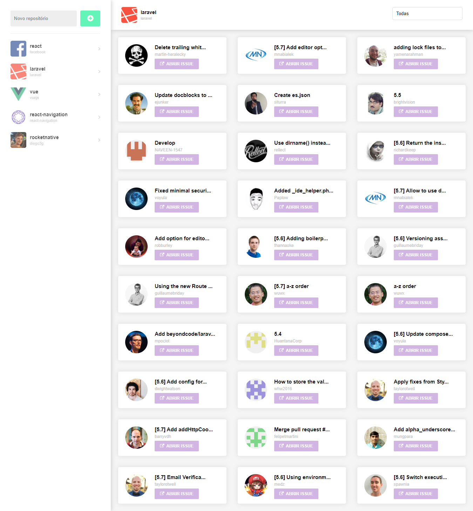

  <h3 align="center">2rd Rocketseat GoReact Challenge</h3>

---

## Overview

2rd challenge of the Rocketseat GoReact course.

## Preview

### APIs

- [Github API](https://api.github.com)

## Running the project

- Clone this repository
- Install all dependencies using the command `yarn`
- Run `yarn start`
- Access `http://localhost:3000/`

## Used technologies

- React
- Axios
- Styled Component
- Other React JS libs
